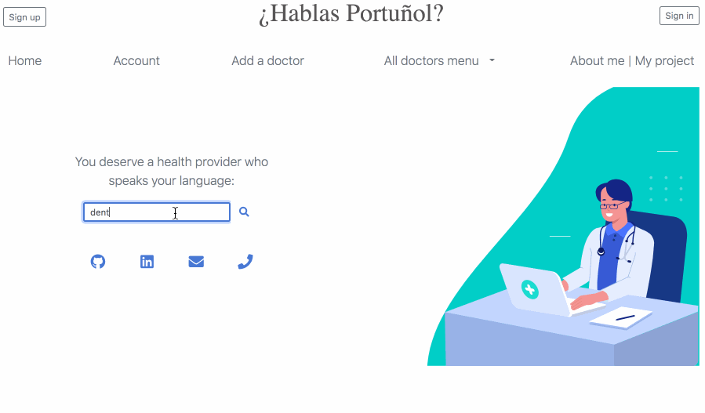
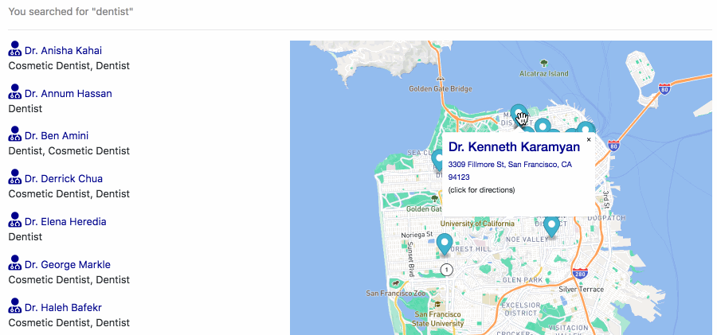
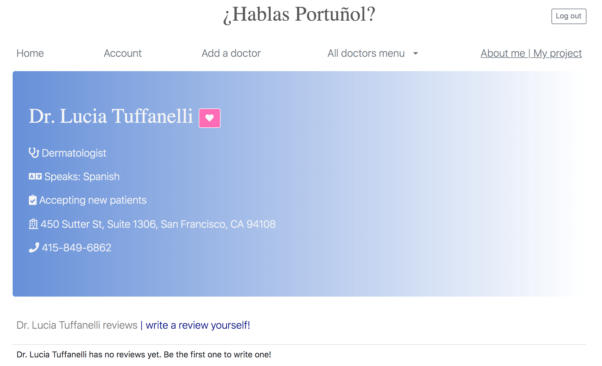
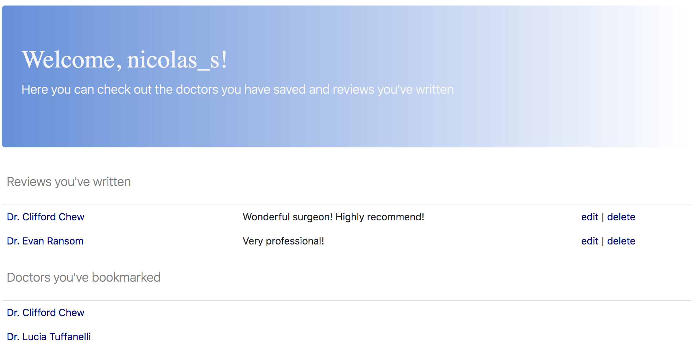

# ¿Hablas Portuñol?

 

**¿Hablas Portuñol?** is a Python Web Application that allows users to locate Spanish and Portuguese-speaking health providers in San Francisco.
Users can also sign up to write reviews, bookmark doctors and contribute to the open source data feature.

### Why? 

 

As a Latin immigrant I’m aware of how effective communication can often get lost in translation. 
Knowing that San Francisco is home to a large Latin population, 
I felt compelled to ensure that language wouldn’t be a barrier for my community to find healthcare,
especially during the year of 2020.

## Take a sneak peak!
*(check out a full demo [here](https://www.youtube.com/watch?v=vyi81DIkNi0))*

### The homepage search

	

### The results

	

### The doctor profile

	

### The user account

	

## Tech Stack
#### Database & Database Access 
* PostgreSQL
* SQLAlchemy
#### Web Framework & Template Engine
* Flask
  * Flask-WTF
  * Flask-Login
  * Flask-Bcrypt
* Jinja
#### Programming Languages
* Python
* JavaScript
  * Fecth API
  * JSON
* HTML
* CSS
  * Bootstrap
#### API
* Mapbox GL JS

## Author
**[Luciana Terrazas](https://www.linkedin.com/in/lucianact/)** 

## Acknowledgments

Shoutout to [Hackbright](https://hackbrightacademy.com/) instructors and my mentors Paige Moody and Simon Willison for their support guidance during this project!
